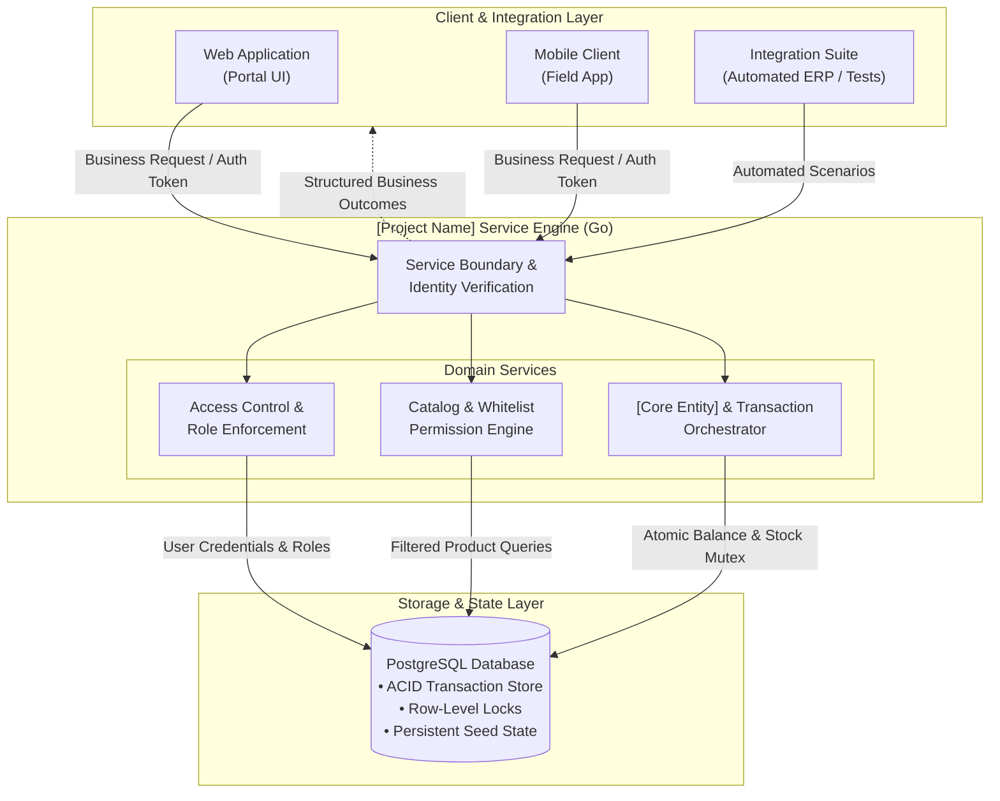
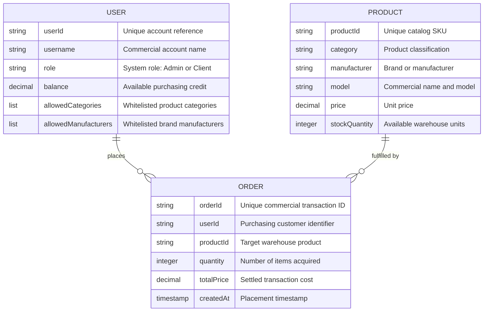
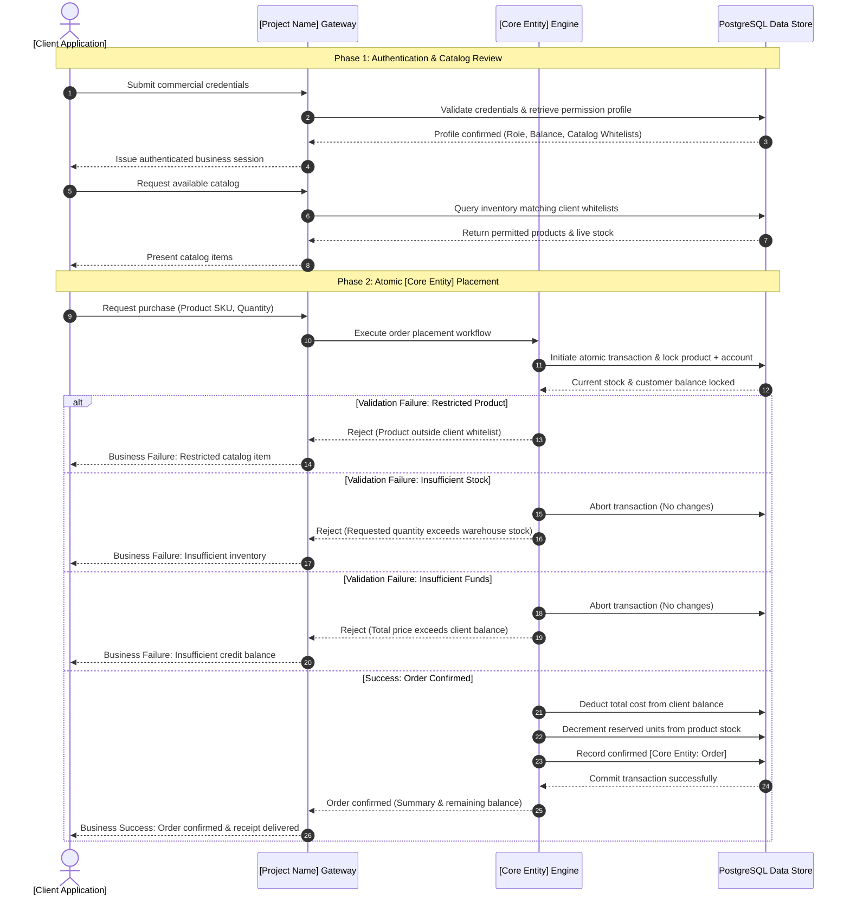
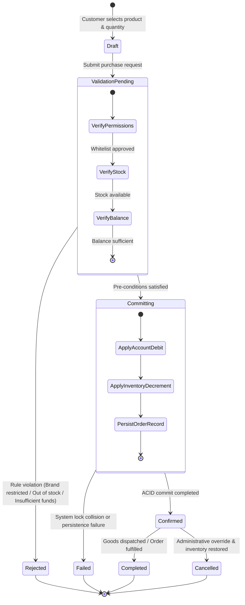

# [Project Name] — Client & Integration Specification

> **Document Type:** External Client-Facing System Specification  
> **Audience:** Business Stakeholders, Product Managers, Technical Integrators, Solutions Architects  
> **Reference Domain:** Warehouse Order & Inventory Management Platform  

---

## 1. Business Overview & Domain Model

### 1.1 Executive Summary
Modern digital commerce and supply chain integrations require reliable, real-time inventory synchronization and transaction integrity. **[Project Name]** delivers a streamlined, resilient backend service designed to handle core catalog exploration, business rule enforcement, and atomic purchasing workflows. 

The core value proposition of **[Project Name]** centers on three key capabilities:
- **Transactional Integrity:** Guarantees absolute consistency between inventory levels and customer balances during purchasing events, eliminating ghost orders, double-spending, and stock discrepancies under high concurrency.
- **Granular Business Access Control:** Empowers enterprise administrators to establish dynamic, user-specific catalog whitelists (e.g., restricting accounts to particular product categories or authorized manufacturers) directly aligned with corporate agreements.
- **Seamless Integrator Experience:** Provides clear, deterministic business contracts and predictable state transitions, allowing frontend applications, mobile clients, and third-party automated pipelines to integrate with minimal implementation overhead.

---

### 1.2 Target Users & Business Use Cases

**[Project Name]** serves two primary user personas within a realistic educational and enterprise-readiness scope:

| Persona | Business Role & Objectives | Key Responsibilities & Capabilities |
| :--- | :--- | :--- |
| **System Administrator** | Operational Overseer & Governance | • Onboards new business accounts and sets roles. • Adjusts and monitors customer commercial balances. • Configures category and brand visibility rules per account. • Registers new catalog items and manages warehouse stock levels. |
| **Client / Customer** | Authorized Purchasing Partner | • Authenticates securely against commercial role boundaries. • Reviews real-time available catalog items filtered to their permissions. • Checks available balance and credit allowances. • Places binding purchase orders for warehouse products. |

#### Realistic Business Use Cases
1. **Catalog Exploration with Access Boundaries:** A corporate client logs into the portal to review products. The system dynamically tailors the catalog, hiding restricted lines and only presenting inventory the client is legally contracted to purchase.
2. **Atomic Inventory Ordering:** A client orders multiple units of a high-demand item. The system verifies balance adequacy, confirms real-time stock availability, reserves the items, and settles payment in a single indivisible step.
3. **Credit & Balance Adjustments:** Administrators top up a customer's purchasing quota upon receipt of off-platform payments or invoices, instantly reflecting the updated purchasing power in client applications.
4. **Partner Automation & Test Sandbox:** Integrators connect automated regression suites or third-party enterprise resource planning (ERP) platforms to test order processing logic against live business scenarios.

---

### 1.3 High-Level Architecture Diagram

The system decouples client presentation from transactional persistence through an idiomatic, lightweight service engine.

---

### 1.4 Conceptual Entity Relationship Diagram

The conceptual domain model emphasizes business relationships and core properties over database constraints or foreign key mechanics.

#### Core Business Entities
- **`[User / Client]`**: Represents an authenticated organization or individual with an assigned operating balance and granular visibility filters.
- **`[Product / Item]`**: Represents warehouse stock available for order placement, categorized by industry type, manufacturer brand, and unit cost.
- **`[Core Entity: Order]`**: Represents the committed contract between a customer and the warehouse, capturing quantity, agreed price, and ownership transfer.

---

## 2. Integration Scenarios & Business Workflows

### 2.1 Key Integration Journeys

#### Journey 1: Commercial Authentication & Role Handshake
1. **Credential Submission:** The client application submits partner credentials through the appropriate role channel (`Admin` or `User`).
2. **Access Verification:** The service confirms that the user identity matches the target channel, preventing privilege escalation.
3. **Session Issuance:** A cryptographically signed session token is returned containing the user's role and identity claims.
4. **Profile & Rule Retrieval:** The client fetches account metadata, including current balance, allowed categories, and permitted manufacturers.

#### Journey 2: Catalog Discovery with Permission Filters
1. **Catalog Query:** The client application requests the active warehouse inventory (optionally filtering by category).
2. **Permission Intersection:** The engine inspects the client's whitelist:
   - If no constraints are configured, all products are accessible.
   - If specific categories or manufacturers are specified, items outside the permitted lists are removed from the result set.
3. **Catalog Presentation:** The filtered inventory with current unit prices and available stock is presented to the client.

#### Journey 3: Transactional Order Placement (`[Core Entity]` Creation)
1. **Order Submission:** The client submits a purchase intent specifying the desired `productId` and `quantity`.
2. **Eligibility Pre-check:** The service validates that the product exists and falls within the client's permission whitelists.
3. **Atomic Execution:**
   - Real-time stock availability is verified.
   - Total purchase cost (`price × quantity`) is computed.
   - User balance adequacy is verified (`balance ≥ total cost`).
   - Stock is decremented and balance is debited simultaneously.
   - An immutable `[Core Entity: Order]` transaction record is committed.
4. **Outcome Delivery:** Confirmation containing the transaction reference, purchased units, and remaining balance is returned to the client.

---

### 2.2 Sequence Diagram: End-to-End Business Flow

The following sequence illustrates the business interaction between the client application, the service layer, and persistent storage during a purchase.

---

### 2.3 Lifecycle / State Diagram: `[Core Entity]`

Every commercial transaction follows a deterministic lifecycle from initial draft submission through validation and terminal settlement.

#### State Definitions
- **`Draft`**: The client is assembling the purchase intent locally prior to submission.
- **`ValidationPending`**: The system evaluates authorization rules, catalog whitelists, warehouse availability, and credit limits.
- **`Rejected`**: A domain rule was breached (e.g., product disallowed by contract, insufficient stock, or balance shortage). No funds or goods are altered.
- **`Committing`**: The system is executing an atomic database lock, updating user balance, and decreasing inventory units.
- **`Confirmed`**: The transaction is successfully committed and bound to the warehouse ledger.
- **`Completed`**: The physical or digital handover of goods has concluded.
- **`Cancelled`**: An administrator has reversed the transaction, returning funds to the customer and restocking the catalog.

---

### 2.4 Business Outcomes & Exceptions

Integrators can design predictable handling around four standard commercial outcomes:

| Business Condition | Primary Trigger | System Behavior | Integrator Guidance |
| :--- | :--- | :--- | :--- |
| **Order Success** | Available balance ≥ total cost AND stock ≥ requested quantity AND product in whitelist. | Creates `[Core Entity: Order]`, debits customer balance, decrements stock atomically, and returns confirmation. | Display order receipt, refresh client balance badge, and prompt for dispatch tracking. |
| **Catalog Access Restriction** | Customer attempts to purchase an item outside assigned `allowed_categories` or `allowed_manufacturers`. | Operation rejected immediately. No ledger locks acquired. | Notify customer of commercial contract restrictions; prompt them to contact their account administrator. |
| **Insufficient Stock** | Requested quantity exceeds current warehouse inventory for the target SKU. | Operation rejected. Transaction rolled back with zero side effects. | Inform user of available inventory quantity; offer partial quantity or notify on restock. |
| **Insufficient Funds** | Total order amount exceeds client's available balance. | Operation rejected. Transaction rolled back with zero side effects. | Prompt client to top up balance or request credit increase from system administrator. |
| **Entity Not Found** | Referenced product SKU or user account does not exist or has been archived. | Operation rejected gracefully. | Refresh local catalog cache and verify product identifier validity. |

---

## 3. Template Customization Reference

This specification is parameterized for rapid adaptation across different enterprise domains:

| Placeholder | Reference Implementation | Alternative Domain Examples |
| :--- | :--- | :--- |
| **`[Project Name]`** | Warehouse REST API Testbench | Logistics Hub, Healthcare Dispatch, Financial Ledger |
| **`[Core Entity]`** | Order | Shipment, Prescription, Payment Voucher, Flight Booking |
| **`[User / Client]`** | Customer / Admin | Hospital / Physician, Merchant / Auditor, Passenger / Travel Agent |
| **`[Product / Item]`** | Warehouse Product (SKU) | Medical Supply, Retail Asset, Security Instrument, Seat Class |
