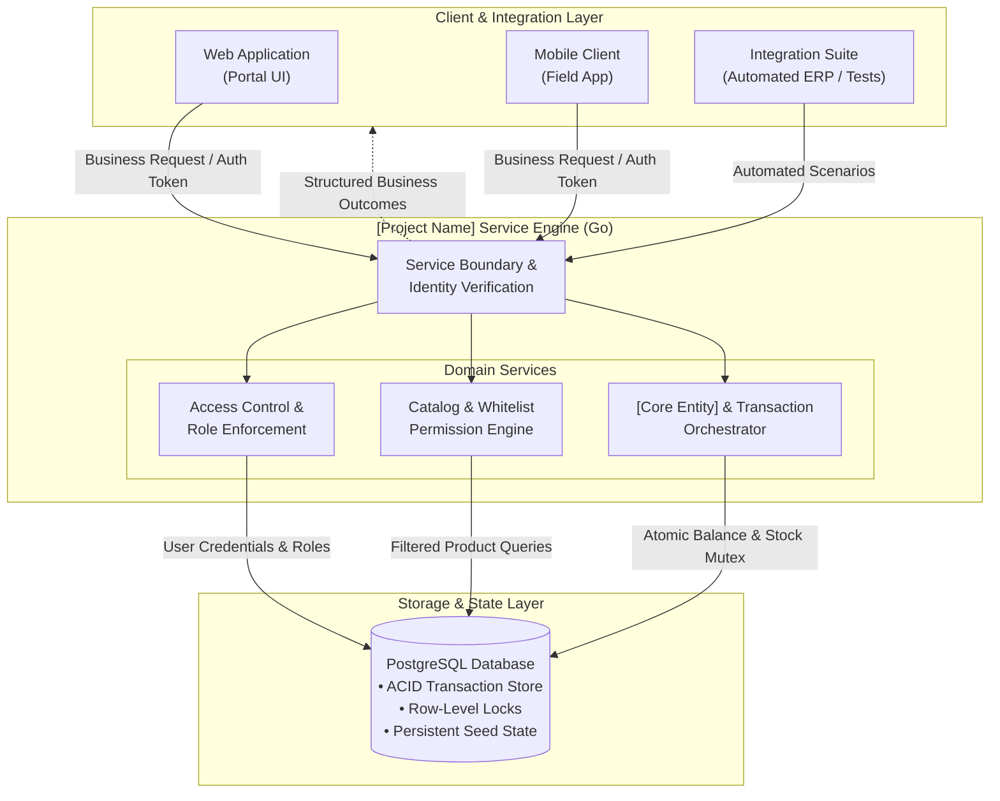
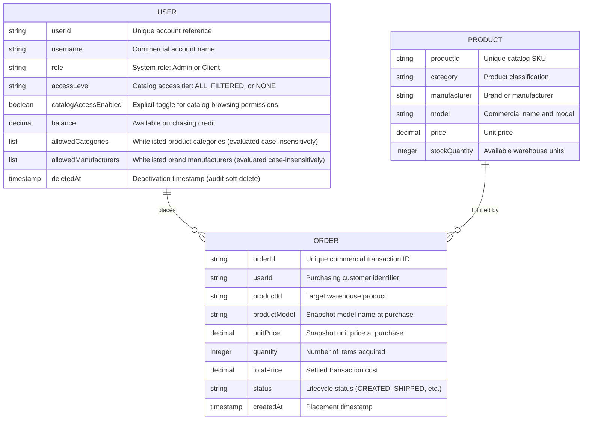
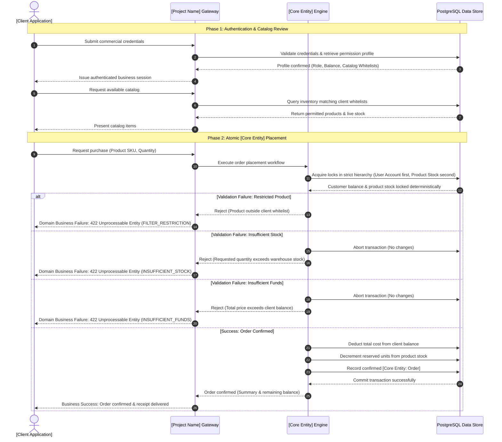
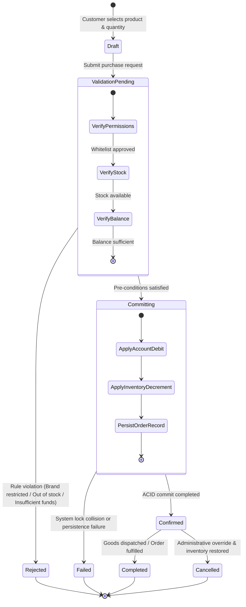

# [Project Name] — Client & Integration Specification

> **Document Type:** External Client-Facing System Specification  
> **Audience:** Business Stakeholders, Product Managers, Technical Integrators, Solutions Architects  
> **Reference Domain:** Warehouse Order & Inventory Management Platform  

---

## 1. Business Overview & Domain Model

### 1.1 Executive Summary
Modern digital commerce and supply chain integrations require reliable, real-time inventory synchronization and transaction integrity. **[Project Name]** delivers a streamlined, resilient backend service designed to handle core catalog exploration, business rule enforcement, and atomic purchasing workflows. 

The core value proposition of **[Project Name]** centers on three key capabilities:
- **Transactional Integrity:** Guarantees absolute consistency between inventory levels and customer balances during purchasing events, eliminating ghost orders, double-spending, and stock discrepancies under high concurrency.
- **Granular Business Access Control:** Empowers enterprise administrators to establish dynamic, user-specific catalog whitelists (e.g., restricting accounts to particular product categories or authorized manufacturers) directly aligned with corporate agreements.
- **Seamless Integrator Experience:** Provides clear, deterministic business contracts and predictable state transitions, allowing frontend applications, mobile clients, and third-party automated pipelines to integrate with minimal implementation overhead.

---

### 1.2 Target Users & Business Use Cases

**[Project Name]** serves two primary user personas within a realistic educational and enterprise-readiness scope:

| Persona | Business Role & Objectives | Key Responsibilities & Capabilities |
| :--- | :--- | :--- |
| **System Administrator** | Operational Overseer & Governance | • Onboards new business accounts and sets roles. • Adjusts and monitors customer commercial balances. • Configures category and brand visibility rules per account. • Registers new catalog items and manages warehouse stock levels. |
| **Client / Customer** | Authorized Purchasing Partner | • Authenticates securely against commercial role boundaries. • Reviews real-time available catalog items filtered to their permissions. • Checks available balance and credit allowances. • Places binding purchase orders for warehouse products. |

#### Realistic Business Use Cases
1. **Catalog Exploration with Access Boundaries:** A corporate client logs into the portal to review products. The system dynamically tailors the catalog, hiding restricted lines and only presenting inventory the client is legally contracted to purchase.
2. **Atomic Inventory Ordering:** A client orders multiple units of a high-demand item. The system verifies balance adequacy, confirms real-time stock availability, reserves the items, and settles payment in a single indivisible step.
3. **Credit & Balance Adjustments:** Administrators dynamically adjust customer balances via dedicated operational actions: a relative top-up increment (`POST /api/admin/users/{id}/balance/top-up`, enforcing minimum increment of $0.01) upon invoice payment, or an absolute balance set (`PUT /api/admin/users/{id}/balance`, enforcing non-negative balance), immediately updating purchasing allowances.
4. **Partner Automation & Test Sandbox:** Integrators connect automated regression suites or third-party enterprise resource planning (ERP) platforms to test order processing logic against live business scenarios.

---

### 1.3 High-Level Architecture Diagram

The system decouples client presentation from transactional persistence through an idiomatic, lightweight service engine.

---

### 1.4 Conceptual Entity Relationship Diagram

The conceptual domain model emphasizes business relationships and core properties over database constraints or foreign key mechanics.

#### Core Business Entities
- **`[User / Client]`**: Represents an authenticated organization or individual with an assigned operating balance, access governance tier (`ALL`, `FILTERED`, `NONE`), and granular visibility filters.
- **`[Product / Item]`**: Represents warehouse stock available for order placement, categorized by industry type, manufacturer brand, and unit cost.
- **`[Core Entity: Order]`**: Represents the committed contract between a customer and the warehouse, capturing quantity, agreed price, immutable historical product model/price snapshots, and ownership transfer.
- **`Financial Precision & Currency Settlement`**: All commercial calculations (balances, prices, transaction totals) are evaluated internally using integer cents to eliminate floating-point drift, guaranteeing exact-cent reconciliation across accounting ledgers while exposing standard dollar representations to client interfaces.

---

## 2. Integration Scenarios & Business Workflows

### 2.1 Key Integration Journeys

#### Journey 1: Commercial Authentication & Role Handshake
1. **Credential Submission:** The client application submits partner credentials through the appropriate role channel (`Admin` or `User`).
2. **Access Verification & Anti-Enumeration Protection:** The service confirms that credentials are valid and the user identity matches the target channel. If credentials fail, the account does not exist, or the role mismatches, the service yields an identical uniform `401 Unauthorized` response with constant-time verification, completely eliminating account enumeration and authentication oracle vectors.
3. **Session Issuance:** A cryptographically signed session token is returned containing the user's role and identity claims.
4. **Profile & Rule Retrieval:** The client fetches account metadata, including current balance, access level (`ALL`, `FILTERED`, `NONE`), catalog enablement flag, allowed categories, and permitted manufacturers.

#### Journey 2: Catalog Discovery with Permission Filters, Sorting, & Pagination
1. **Catalog Query:** The client application requests the active warehouse inventory, supplying optional filter parameters (`category`, `manufacturer`), sorting parameters (`sort_by`: `price`, `created_at`, `model`; `order`: `asc`, `desc`), and pagination controls (`page`: default `1`, `page_size`/`limit`: default `20`, max `100`).
2. **Permission Intersection & Case-Insensitive Matching:** The engine inspects the client's access governance:
   - **Zero-Access Restriction (`NONE` or Disabled):** If `access_level` is `NONE` or `catalog_access_enabled` is `false`, the client is prohibited from viewing items, returning an empty catalog (`[]`) with `total_count: 0` and `total_pages: 0`. Attempts to order trigger an immediate `422 Unprocessable Entity` with `FILTER_RESTRICTION`.
   - **Full Catalog Access (`ALL`):** If `access_level` is `ALL`, all warehouse products matching optional `category` or `manufacturer` filters are accessible without restriction.
   - **Filtered Catalog Access (`FILTERED`):** Items are filtered by comparing `allowed_categories` and `allowed_manufacturers` using case-insensitive normalization (`LOWER(TRIM(...))`), ensuring mixed-casing variations (e.g. `"apple"` vs `"Apple"`, `"laptop"` vs `"Laptop"`) match reliably without silent omissions.
3. **Catalog Presentation & Navigation:** The system sorts matching items deterministically, returns the requested page slice, and wraps results in a paginated envelope containing navigation metadata (`total_count`, `page`, `page_size`, `total_pages`).

#### Journey 3: Transactional Order Placement (`[Core Entity]` Creation)
1. **Order Submission:** The client submits a purchase intent specifying the desired `productId` and `quantity`. Clients may supply an optional `Idempotency-Key` header to guard against duplicate orders and double deductions caused by network timeouts and retries.
2. **Eligibility Pre-check & Idempotency Resolution:**
   - If an `Idempotency-Key` is supplied, the system verifies previous executions: replayed requests return the original receipt immediately with zero additional deduction; concurrent conflicting requests are rejected.
   - The service validates that the product exists and falls within the client's permission whitelists.
3. **Atomic Execution:**
   - Real-time stock availability is verified.
   - Total purchase cost (`price × quantity`) is computed.
   - User balance adequacy is verified (`balance ≥ total cost`).
   - Stock is decremented and balance is debited simultaneously.
   - An immutable `[Core Entity: Order]` transaction record is committed.
4. **Outcome Delivery:** Confirmation containing the transaction reference, purchased units, and remaining balance is returned to the client (and cached for 24 hours under the idempotency key).

---

### 2.2 Sequence Diagram: End-to-End Business Flow

The following sequence illustrates the business interaction between the client application, the service layer, and persistent storage during a purchase.

---

### 2.3 Lifecycle / State Diagram: `[Core Entity]`

Every commercial transaction follows a deterministic lifecycle from initial draft submission through validation and terminal settlement.

#### State Definitions
- **`Draft`**: The client is assembling the purchase intent locally prior to submission.
- **`ValidationPending`**: The system evaluates authorization rules, catalog whitelists, warehouse availability, and credit limits.
- **`Rejected`**: A domain rule was breached (e.g., product disallowed by contract, insufficient stock, or balance shortage). No funds or goods are altered.
- **`Committing`**: The system is executing an atomic database lock, updating user balance, and decreasing inventory units.
- **`Confirmed`**: The transaction is successfully committed and bound to the warehouse ledger.
- **`Completed`**: The physical or digital handover of goods has concluded.
- **`Cancelled`**: An administrator has reversed the transaction, returning funds to the customer and restocking the catalog.

---

### 2.4 Business Outcomes & Exceptions

Integrators can design predictable error handling and recovery workflows around standardized status code contracts:

| Business Condition | Primary Trigger | Status Code & Error Code | System Behavior | Integrator Guidance |
| :--- | :--- | :--- | :--- | :--- |
| **Order Success** | Available balance ≥ total cost AND stock ≥ requested quantity AND product in whitelist. | `201 Created` | Creates `[Core Entity: Order]`, debits customer balance, decrements stock atomically, and returns confirmation. | Display order receipt, refresh client balance badge, and prompt for dispatch tracking. |
| **Catalog Access Restriction** | Customer attempts to purchase an item outside assigned whitelists or account has `access_level: NONE` / `catalog_access_enabled: false`. | `422 Unprocessable Entity` (`FILTER_RESTRICTION`) | Operation rejected immediately. No ledger locks acquired. | Notify customer of commercial contract restrictions or account suspension; prompt them to contact their account administrator. |
| **Insufficient Stock** | Requested quantity exceeds current warehouse inventory for the target SKU. | `422 Unprocessable Entity` (`INSUFFICIENT_STOCK`) | Operation rejected. Transaction rolled back with zero side effects. | Inform user of available inventory quantity; offer partial quantity or notify on restock. |
| **Insufficient Funds** | Total order amount exceeds client's available balance. | `422 Unprocessable Entity` (`INSUFFICIENT_FUNDS`) | Operation rejected. Transaction rolled back with zero side effects. | Prompt client to top up balance or request credit increase from system administrator. |
| **Entity Not Found** | Referenced product SKU, order ID, or user account does not exist or has been archived. | `404 Not Found` (`NOT_FOUND`) | Operation rejected without mutation. | Refresh local catalog cache and verify product/order identifier validity. |
| **Resource / State Conflict** | Registration with duplicate username, concurrent in-flight idempotency request, or conflicting payload under same key. | `409 Conflict` (`USERNAME_TAKEN`, `IDEMPOTENCY_CONFLICT`) | Operation aborted without double mutation or duplicate account creation. | Prompt user to choose an alternative username, or retry idempotency key after in-flight request finishes. |
| **Input Validation / Malformed Request** | Missing mandatory field, invalid UUID format, or boundary violation (e.g. quantity < 1). | `400 Bad Request` (`INVALID_INPUT`, `INVALID_REQUEST`, `INVALID_ID`) | Request rejected before touching database or acquiring locks. | Correct request format or payload boundaries prior to resubmission. |
| **Authentication & Authorization Failure** | Missing/invalid Bearer JWT or attempting administrative operations with customer credentials. | `401 Unauthorized` / `403 Forbidden` (`UNAUTHORIZED`, `FORBIDDEN`) | Request rejected at security boundary. | Re-authenticate client via appropriate login endpoint or check role privileges. |

---

### 2.5 Input Schema Contracts & Boundary Validations

Client applications and automated SDK generators rely on strict, machine-readable validation contracts to reject invalid requests early:
- **Mandatory Fields**: Request payloads enforce non-empty requirements across core identifiers, credentials, and amounts.
- **Identifier Format**: Path variables and identifier fields require valid RFC 4122 UUID strings (e.g. `d0000000-0000-0000-0000-000000000001`).
- **Enumerated Types**: Role assignments are strictly constrained to `admin` or `user`. Order fulfillment transitions follow standard states (`CREATED`, `PROCESSING`, `SHIPPED`, `DELIVERED`, `CANCELLED`).
- **Domain Boundaries**: Order quantities must be at least 1 unit; product stock quantities, unit prices, and account balances must be non-negative ($\ge 0$). User account creation requires minimum string lengths (username $\ge 1$, password $\ge 4$).

Violations of input formats or domain boundaries trigger immediate `400 Bad Request` responses prior to downstream processing.

---

## 3. Template Customization Reference

This specification is parameterized for rapid adaptation across different enterprise domains:

| Placeholder | Reference Implementation | Alternative Domain Examples |
| :--- | :--- | :--- |
| **`[Project Name]`** | Warehouse REST API Testbench | Logistics Hub, Healthcare Dispatch, Financial Ledger |
| **`[Core Entity]`** | Order | Shipment, Prescription, Payment Voucher, Flight Booking |
| **`[User / Client]`** | Customer / Admin | Hospital / Physician, Merchant / Auditor, Passenger / Travel Agent |
| **`[Product / Item]`** | Warehouse Product (SKU) | Medical Supply, Retail Asset, Security Instrument, Seat Class |
