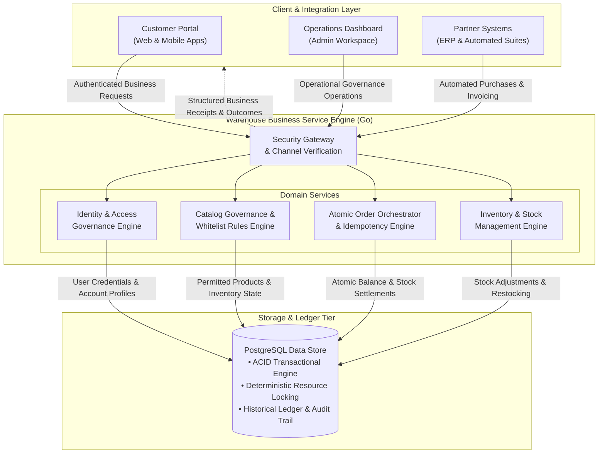
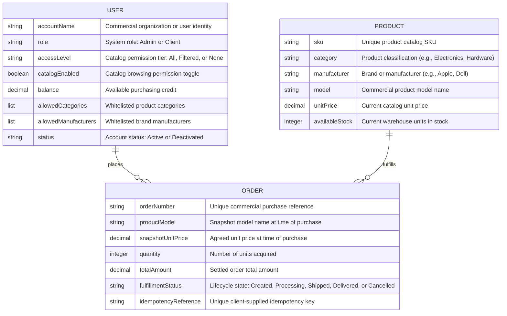
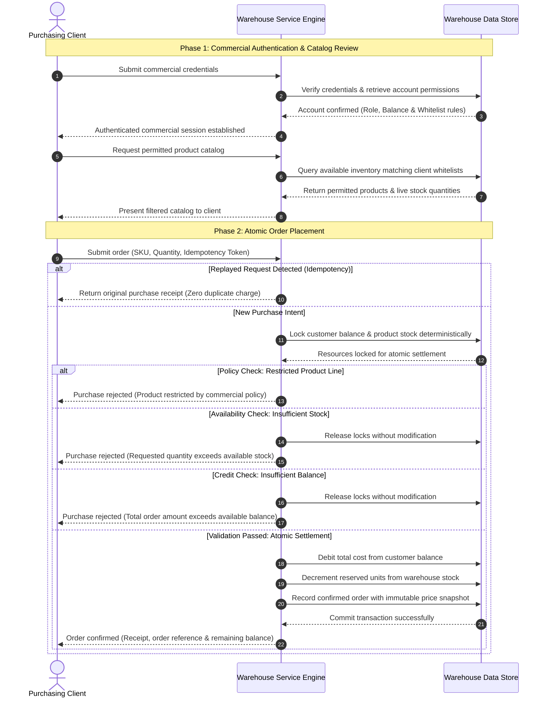
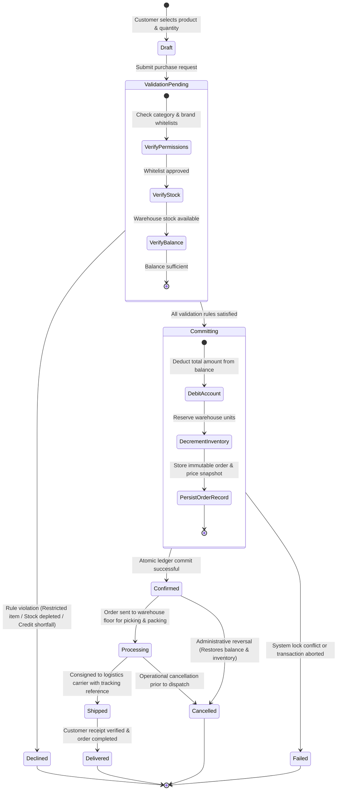

# Warehouse REST API — Client & Integration Specification

> **Document Type:** External Client-Facing Business & Integration Specification  
> **Audience:** Business Stakeholders, Product Managers, Solutions Architects, Client Integrators  
> **Reference Domain:** Warehouse Inventory & Transactional Order Management Platform  

---

## 1. Business Overview & Domain Model

### Executive Summary

Modern commerce, logistics, and supply chain integrations require real-time inventory visibility and uncompromising transaction integrity. In high-velocity commercial environments, traditional systems often encounter critical vulnerabilities: overselling limited stock under concurrent demand, inconsistent financial ledgers from uncoordinated deductions, unauthorized ordering outside contractual partner terms, and accidental duplicate billing caused by network retries.

The **Warehouse REST API Platform** solves these operational challenges by providing a robust, highly resilient transaction service designed for seamless integration with client applications, partner portals, and automated enterprise resource planning (ERP) systems.

#### Core Value Delivered
- **Atomic Transactional Integrity:** Balances and warehouse inventory are bound within strict, all-or-nothing transactional guarantees. Stock decrements and account debits occur indivisibly, eliminating overselling, negative inventory, balance overdrafts, and phantom orders under peak concurrency.
- **Contract-Governed Catalog Whitelisting:** Administrators can dynamically enforce account-level brand and category permissions. Clients only discover and purchase products they are legally contracted to acquire, preventing compliance disputes and unauthorized order processing.
- **Idempotent Commercial Execution:** Purchase submissions and financial adjustments support idempotency tokens. Network retries, client timeouts, or connection disconnects safely return the original transaction confirmation without duplicate deductions or split orders.
- **Auditable Financial Precision:** All financial calculations (account balances, unit prices, transaction totals) are managed with exact-cent precision, eliminating floating-point rounding drift across corporate ledgers while maintaining immutable historical price snapshots on every completed transaction.

---

### Target Users & Business Use Cases

The platform serves two primary commercial personas within an enterprise warehouse ecosystem:

| Persona | Business Role & Objectives | Key Responsibilities & Capabilities |
| :--- | :--- | :--- |
| **Warehouse Administrator** | Operational Overseer & System Governance | • Onboard new client accounts and govern organizational credentials. • Credit customer balances upon invoice settlement or adjust credit ceilings. • Configure category and manufacturer whitelists aligned with partner contracts. • Register catalog items, manage inventory, and oversee fulfillment lifecycles. |
| **Purchasing Client** | Commercial Partner & Authorized Buyer | • Authenticate securely through commercial role channels. • Explore permitted warehouse products with real-time stock availability. • Monitor active purchasing credit and available operational balances. • Submit binding purchase orders with automated idempotency safeguards. • Inspect transaction history and track fulfillment status through delivery. |

#### Core Business Use Cases
1. **Contract-Governed Catalog Browsing:** A purchasing client explores warehouse stock. The system dynamically filters the catalog based on contractual permissions, presenting only authorized product lines and hiding restricted inventory.
2. **Atomic Inventory Ordering:** A client places an order for multiple units of high-demand items. The platform atomically validates product permissions, confirms available warehouse stock, checks credit adequacy, reserves inventory, and settles payment in a single indivisible transaction.
3. **Operational Credit Management:** Following receipt of a wire transfer or commercial invoice payment, an operations administrator credits the customer's balance via an incremental top-up, immediately unlocking purchasing capacity.
4. **Fulfillment Tracking & Reconciliation:** Operations teams progress orders from warehouse packing through carrier dispatch and delivery, providing end-to-end status visibility for customer operations and financial audits.

---

### High-Level Architecture Diagram

The system architecture cleanly decouples client interaction from transaction orchestration and persistence, ensuring high availability, strict security boundaries, and reliable ledger synchronization:

---

### Conceptual Entity Relationship Diagram

The conceptual domain model focuses on core business entities, their commercial relationships, and primary domain attributes, abstracting away low-level database mechanics:

#### Core Business Entities
- **User / Customer:** Represents an authenticated commercial account possessing an operational balance, an access tier (`All`, `Filtered`, or `None`), and category/brand whitelist rules governing which products may be viewed or purchased.
- **Product:** Represents warehouse merchandise available for order placement, categorized by industry type, manufacturer brand, and unit cost.
- **Order:** Represents a legally binding transaction between a customer and the warehouse, capturing quantity, settled total amount, and immutable historical price/model snapshots.
- **Financial Precision Standard:** All financial amounts (balances, prices, settlement totals) are calculated and reconciled to the exact cent, eliminating rounding discrepancies between customer receipts and internal accounting ledgers.

---

## 2. Integration Scenarios & Business Workflows

### Key User Journeys

#### Journey 1: Commercial Authentication & Account Handshake
1. **Credential Submission:** The client application transmits commercial credentials through the appropriate role channel (Customer or Administrator).
2. **Timing-Safe Identity Verification:** The platform validates identity and role membership using constant-time verification, mitigating user enumeration and side-channel threats.
3. **Session Establishment:** Upon successful verification, the system issues an authenticated commercial session.
4. **Profile & Permission Hydration:** The client retrieves its commercial profile, including current purchasing balance, access permission tier, and approved category/brand whitelists.

#### Journey 2: Permission-Aware Catalog Exploration & Filtering
1. **Catalog Query:** The client application requests the active warehouse inventory, optionally supplying category or manufacturer search filters, sorting preferences, and pagination controls.
2. **Access Governance Evaluation:** The engine applies account-level visibility rules:
   - **Restricted Access (`None` or Disabled):** If the account has catalog access disabled or assigned to `None`, an empty catalog is returned. Any order attempt triggers an immediate policy violation rejection.
   - **Unrestricted Access (`All`):** The client may view all warehouse products matching optional search filters.
   - **Filtered Access (`Filtered`):** Products are matched case-insensitively against the client's whitelisted categories and manufacturers, guaranteeing reliable matching regardless of casing variations.
3. **Catalog Presentation:** The system presents permitted items along with live warehouse stock availability and pagination metadata.

#### Journey 3: Idempotent Atomic Order Placement
1. **Purchase Intent Submission:** The client submits a purchase request specifying target product SKU, desired quantity, and an optional client-generated idempotency key.
2. **Idempotency Check:**
   - If the request is a replay of an existing completed order under the same key, the original confirmation is returned immediately with zero additional deduction.
   - If an operation with the same key is currently executing, duplicate execution is blocked.
3. **Eligibility & Inventory Validation:** The platform verifies product existence, ensures the item is within the client's whitelist, confirms warehouse stock sufficiency, and verifies credit adequacy.
4. **Atomic Settlement:** The service executes balance debit and inventory decrement as a single atomic operation, captures an immutable price/model snapshot, and records the confirmed order.
5. **Outcome Delivery:** An order confirmation receipt containing the transaction reference, purchased units, and remaining balance is returned to the client.

#### Journey 4: Administrative Balance & Fulfillment Governance
1. **Balance Adjustment:** Administrators deposit funds into customer accounts via relative top-ups (e.g., following wire transfers) or set absolute balance limits.
2. **Permission Maintenance:** Administrators update category and brand whitelists as partner agreements expand.
3. **Fulfillment Progress:** Warehouse staff progress orders through operational fulfillment stages from receipt through packing, dispatch, and delivery.

---

### Sequence Diagram: End-to-End Business Flow

The following sequence illustrates the end-to-end commercial transaction flow, highlighting actor interactions, domain rules, and atomic execution without technical HTTP minutiae:

---

### Entity Lifecycle / State Diagram

Every order progresses through a deterministic lifecycle, transitioning from initial draft intent to final delivery or cancellation:

#### Lifecycle State Definitions
- **`Draft`**: The customer is preparing the purchase intent locally prior to submission.
- **`ValidationPending`**: The platform is validating commercial eligibility, whitelist rules, real-time warehouse inventory, and account balance.
- **`Declined`**: A business rule was breached (item restricted by contract, insufficient stock, or balance shortage). No funds or inventory are altered.
- **`Committing`**: The system is executing an atomic database lock, updating customer balance, and decreasing inventory units.
- **`Confirmed`**: The transaction is committed and bound to the commercial ledger. An immutable price and product snapshot is recorded.
- **`Processing`**: Warehouse staff are picking, packing, and preparing items for dispatch.
- **`Shipped`**: The order has been transferred to a carrier for transport.
- **`Delivered`**: Goods have arrived at the customer destination, successfully completing the commercial order.
- **`Cancelled`**: An administrator has annulled the order prior to delivery, releasing stock back to the catalog and refunding the customer balance.

---

### Business Outcomes & Exception Handling

Integrators can design predictable recovery workflows and client user interfaces based on clear domain-level outcomes:

| Business Condition | Trigger & Cause | System Behavior | Client Integrator Guidance |
| :--- | :--- | :--- | :--- |
| **Order Confirmation** | Client balance $\ge$ total cost, stock $\ge$ quantity, and product allowed by whitelist. | Balance debited, stock decremented, immutable price snapshot recorded, and confirmation issued. | Display order receipt, update account balance badge, and offer shipment tracking. |
| **Catalog Policy Restriction** | Client attempts to order an item outside contractual category/brand whitelists, or catalog access is disabled. | Operation declined immediately without resource locks or state mutation. | Inform client of commercial agreement boundaries; prompt client to request whitelist updates from administrators. |
| **Insufficient Warehouse Stock** | Requested units exceed currently available inventory for the target SKU. | Operation declined without state modification. Balance remains untouched. | Inform user of available stock; offer partial quantity purchase or notify upon restock. |
| **Insufficient Account Balance** | Total purchase amount exceeds available purchasing balance. | Operation declined without state modification. Inventory remains untouched. | Prompt client to top up balance or request credit limit adjustment from administrator. |
| **Duplicate Action (Idempotency Replay)** | Re-transmitting an order with a previously processed idempotency key. | System recognizes previous completion and returns original confirmation without re-executing deduction. | Treat as successful completion; display original receipt and update client interface seamlessly. |
| **Concurrent Action Conflict** | Simultaneous submission of identical operations with the same idempotency key. | In-flight collision is detected; subsequent concurrent request is safely rejected to prevent race conditions. | Advise client to await completion of in-flight operation before retrying. |
| **Entity Not Found** | Target SKU, order reference, or account identifier does not exist or was archived. | Request rejected without data mutation. | Refresh client catalog cache and verify entity identifiers before resubmitting. |
| **Input Boundary Violation** | Submitting non-positive quantity, negative balance, or malformed identifiers. | Request rejected at input boundary before touching database or acquiring locks. | Ensure client form validation enforces non-negative inputs and valid identifier formats. |
| **Channel Privilege Rejection** | Missing valid session credentials or attempting administrative functions with client credentials. | Request rejected at security boundary. | Direct client to commercial login portal or check organizational role privileges. |
| **System Disruption / Maintenance** | Temporary infrastructure unavailability, maintenance window, or unhandled system fault. | Transaction safely aborted and rolled back. Ledger integrity preserved with zero side effects. | Implement exponential backoff retry policy; include request correlation reference if reporting issue. |
